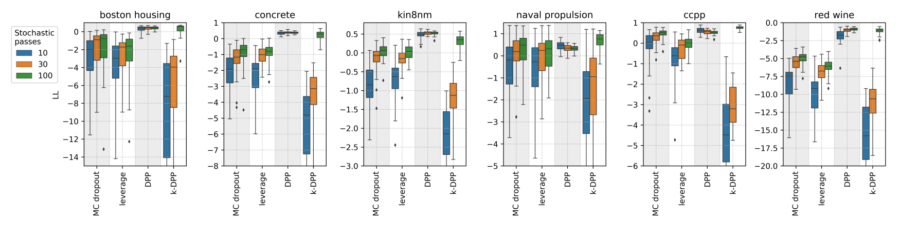

# Uncertainty estimation via decorrelation and DPP
Code for paper "Dropout Strikes Back: Improved Uncertainty
Estimation via Diversity Sampling" by Evgenii Tsymbalov, Kirill Fedyanin, Maxim Panov

Main code with implemented methods (DPP, k-DPP, leverages masks for dropout) are in our [alpaca library](https://github.com/stat-ml/alpaca)


### Motivation


For regression tasks, it could be useful to know not just a prediction but also a confidence interval. It's hard to do it in the close form for deep learning, but to estimate, you can you so-called [ensembles](https://arxiv.org/abs/1612.01474) of several models. To avoid training and keeping several models, you could use[monte-carlo dropout](https://arxiv.org/abs/1506.02142) on inference.

To use MC dropout, you need multiple forward passes; converging requires tens or even hundreds of forward passes.


We propose to force the diversity of forward passes by hiring determinantal point processes. See how it improves the log-likelihood metric across various UCI datasets for the different numbers of stochastic passes T = 10, 30, 100.




### Paper

You can read full paper on [https://arxiv.org/abs/2003.03274](https://arxiv.org/abs/2003.03274)

For the citation, please use

@InProceedings{Fedyanin2021DropoutSB,
author="Fedyanin, Kirill
and Tsymbalov, Evgenii
and Panov, Maxim",
title="Dropout Strikes Back: Improved Uncertainty Estimation via Diversity Sampling",
booktitle="Recent Trends in Analysis of Images, Social Networks and Texts",
year="2022",
publisher="Springer International Publishing",
pages="125--137",
isbn="978-3-031-15168-2"
}


## Install dependency
```
pip install -r requirements.txt
```

## Regression
To get the experiment results from the paper, run the following notebooks
- `experiments/regression_1_big_exper_train-clean.ipynb` to train the models
- `experiments/regression_2_ll_on_trained_models.ipynb` to get the ll values for different datasets
- `experiments/regression_3_ood_w_training.ipynb` for the OOD experiments

## Classification

From the experiment folder run the following scripts. They goes in pairs, first script trains models and estimate the uncertainty, second just print the results.

#### Accuracy experiment on MNIST
```bash
python classification_ue.py mnist
python print_confidence_accuracy.py mnist
```
#### Accuracy experiment on CIFAR
```bash
python classification_ue.py cifar 
python print_confidence_accuracy.py cifar 
```
#### Accuracy experiment on ImageNet 
For the imagenet you need to manually download validation dataset (version ILSVRC2012) and put images to the `experiments/data/imagenet/valid` folder
```bash
python classification_imagenet.py 
python print_confidence_accuracy.py imagenet
```
#### OOD experiment on MNIST
```bash
python classification_ue_ood.py mnist
python print_ood.py mnist
```
#### OOD experiment on CIFAR 
```bash
python classification_ue_ood.py cifar 
python print_ood.py cifar 
```
#### OOD experiment on ImageNet 
```bash
python classification_imagenet.py --ood
python print_ood.py imagenet 
```

You can change the uncertainty estimation function for mnist/cifar by adding `-a=var_ratio` or `-a=max_prob` keys to the scripts.
