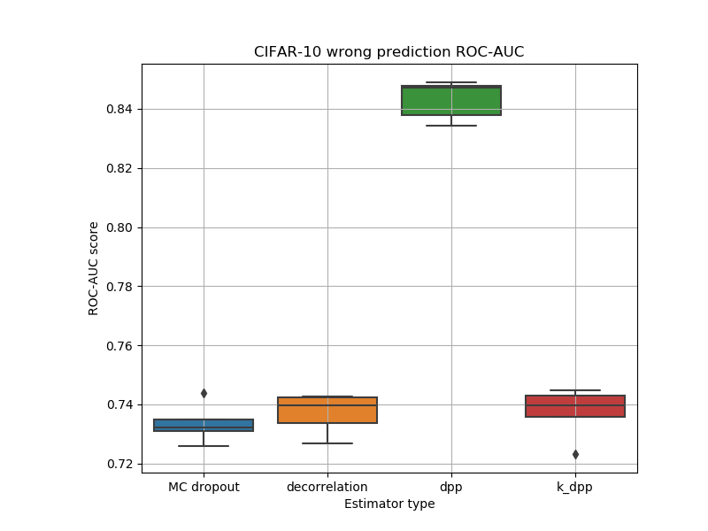
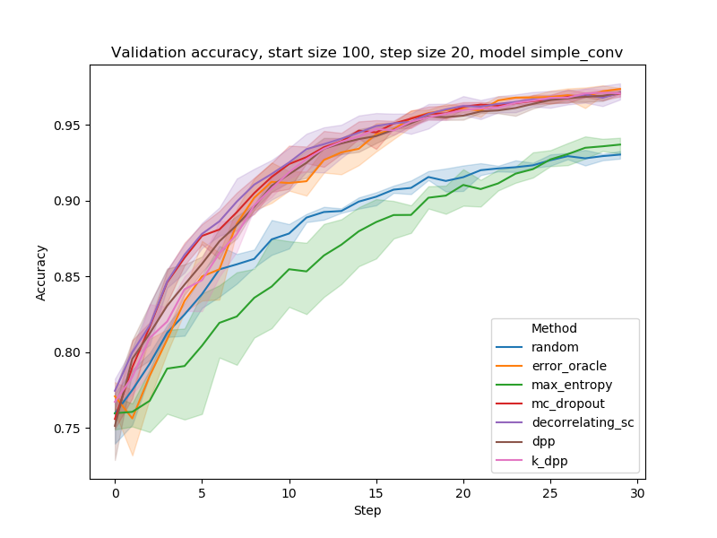

# Uncertainty estimation via decorrelation and DPP

Code for paper "Dropout Strikes Back: Improved Uncertainty Estimation via Diversity Sampled Implicit Ensembles" by Evgenii Tsymbalov, Kirill Fedyanin and Maxim Panov 

 Our method improves Monte-Carlo dropout on inference for uncertainty estimation. Usually dropout masks are sampled randomly by Bernoulli distribution, we propose to sample them in a 'smart' data-based way, using decorrelation or determinantal point processes (DPP)

Main code is implemented in our [alpaca library for active learning and uncertainty estimation](https://github.com/stat-ml/alpaca). This repository is for experiments themselves - to benchmark the performance and reproduce the results.

## Regression
#### Uncertainty regions and visualization 
Qualitative research. The idea is that uncertainty should be high in trained area and low for far regions. For the code, open notebook `experiments/regression_visual-circles.ipynb`

#### Dolan-More curves
Series of experiments on few UCI datasets. We report performance for all experiments in one plot of [Dolan-More curve](https://abelsiqueira.github.io/blog/introduction-to-performance-profile/) for uncertainty accuracy.
It's a quite big experiment and it took few days on Nvidia P100, so it's divided in three parts
- Train models for each dataset - notebook `experiments/regression_1_big_exper_train-clean.ipynb`
- Generate uncertainty estimation and metrics - notebook `experiments/regression_2_prfm2.ipynb`
- Plot the results - notebook `experiments/regression_3_dolan-more.ipynb`


## Classification
#### Error detection benchmark
Uncertainty estimation can be interpreted as an error detector. Thus we can treat it as prediction for binary task of correct/incorrect prediction. We report boxplots for ROC-AUC on MNIST/CIFAR/SVHN by rerunning few times experiment for each dataset-method pair.
```
python experiments/classification_error_detection.py
```
The script generates plots in `experiments/data/detector` folder
#### OOD detection benchmark
Uncertainty estimation can be interpreted as an out-of-distribution samples detector. Thus we can treat it as prediction for binary task of in-distribution/out-of-distribution detection. We use two pairs of datasets: MNIST/Fashion-MNIST and CIFAR/SVHH. We report boxplots for ROC-AUC on MNIST/CIFAR/SVHN by rerunning few times experiment for each dataset-method pair.
```
python experiments/classification_ood_detection.py
```
The script generates plots in `experiments/data/ood` folder



#### Active Learning for computer vision
[Active learning](https://en.wikipedia.org/wiki/Active_learning_(machine_learning) was run for computer vision tasks on MNIST/CIFAR/SVHN datasets. We report plot with error improvements on each step.
```
python experiments/classification_active_learning.py
```
The script generates plots in `experiments/data/al` folder



## Cite

TODO: add bibitex

## Reproducibility
In most experiments* we provided the SEED variable inside the scripts, so you should be able to get the exact numbers.

*- Except the Dolan-More one, because it was too big to rerun with seed, unfortunately.
